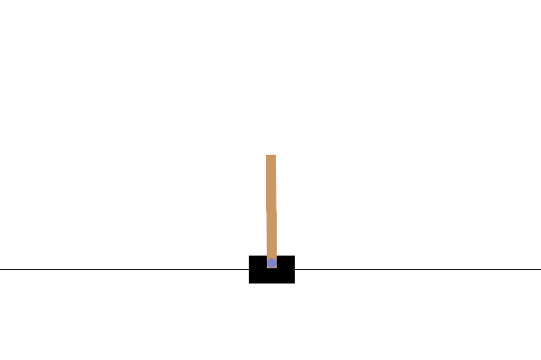

# 🏗️ CartPole-v1: DQN with OpenAI Gym 

OpenAI Gym의 `CartPole-v1` 환경에서 DQN(Deep Q-Network)을 구현하고 학습 성능을 실험한 미니 프로젝트이다.
CartPole은 연속적인 상태공간을 가지면서도 구조가 단순해, 강화학습 알고리즘의 성능을 검증하고 분석하기에 적합하다.
학습 안정성을 높이기 위해 Target Network와 Experience Replay 기법을 적용하였으며,
탐험(exploration)을 충분히 유도하기 위해 ε(epsilon) 값을 초기에는 크게 설정하고, 학습이 진행됨에 따라 점진적으로 감소시키는 epsilon decay 전략을 사용하였다.

📖 개념 설명 블로그 → https://van-liebling.tistory.com/41

## 📁 프로젝트 구조

```bash
.
├── algorithms/
│   └── dqn.py                    # DQN 업데이트 구현
│
├── environment/
│   ├── gym_trainer.py            # Gym 환경 초기화, 정책책 학습 및 평가 유틸리티
│   └── gym_test.py               # 저장된 정책 시각화 (gif로 저장) 테스트용 스크립트
│
├── experiment/
│   └── run_dqn.py                # 전체 실험 실행 스크립트트
│
├── results/                      # 학습된 정책 및및 평가 결과 저장
│
└── setup/
    └── dqn_arg.yaml              # 실험 파라미터 설정 파일
```
## Core Components

- **Q-Network**: 상태(state)를 입력 받아 각 행동(action)의 Q값을 출력
- **Target Network**: 학습 안정화를 위한 별도 Q 네트워크
- **Replay Buffer**: 과거 경험을 저장하고 랜덤 샘플링하여 학습


## Main Logic

- **Epsilon-Greedy Policy**  
  일정 확률(ε)로 무작위 행동을 선택하여 탐험, 나머지 확률로 최적 행동 선택

- **TD Target 계산**  
  다음 상태에서 최대 Q값을 이용해 TD target 생성

- **Loss Function**  
  현재 Q값과 TD target 간의 Mean Squared Error(MSE) 최소화

- **Target Network Update**  
  일정 주기마다 Q-Network의 파라미터를 Target Network에 복사
---

## 🚀 실행 방법

```bash
# [1] 전체 실행
# - FrozenLake 환경 초기화
# - SARSA 및 Q-learning 수행
# - 수렴된 시점의 policy 저장 (.npy)
# - episode 별 reward 결과 저장 (.csv)
# - setting은 setup/dp_arg.yaml 파일에서 변경 가능`

python -m experiment.run_dqn

# [2] 이미 학습된 정책을 기반으로 시뮬레이션만 수행
# - 저장된 policy(.npy)를 불러와서 실행
# - agent의 움직임을 .gif로 저장

python -m environment.gym_test
```

## 📘 코드 설명

### `algorithms/`

- **`dqn.py`**  
  Q-Network를 통해 행동별 Q값을 근사하고, Replay Buffer를 이용해 샘플 효율을 높이며, Target Network를 이용해 학습의 안정성을 보장하는 DQN 에이전트 구현.

### `environment/`

- **`gym_trainer.py`**  
  Gym 환경 초기화 및 관리, 학습 루프 및 평가 도구 제공. 학습 중 reward를 기록하고, 훈련된 모델을 평가하는 기능 포함.

- **`gym_test.py`**  
  학습된 모델을 이용해 CartPole 환경에서 에이전트의 동작을 시각화하고 `.gif` 파일로 저장하는 테스트 스크립트.

### `experiment/`

- **`run_dqn.py`**  
  전체 학습 및 테스트 프로세스를 실행하는 메인 스크립트. 설정 로딩 → 에이전트 학습 → 결과 저장 → 모델 평가 진행.

### `setup/`

- **`dqn_arg.yaml`**  
  환경 이름, 렌더링 모드, DQN 학습 하이퍼파라미터를 설정하는 YAML 파일.

---

## 📂 결과 확인

코드 실행이 끝나면 `results/` 폴더에 다음과 같은 결과 파일이 생성된다:

- **`model.pth`**  
  최종 학습된 Q-Network 파라미터 저장 파일.

- **`train_data.csv`**  
  학습 과정에서의 episode별 평균 reward 및 loss를 기록한 CSV 파일.

- **`gif/*.gif`**  
  `gym_test.py`를 통해 생성된 시각화 결과 (agent의 action sequence)

---

## 📊 에피소드 예시



---

학습 조건:  
- 초기 epsilon=1.0, 최소 epsilon=0.01, epsilon decay=0.995
- learning rate = 1e-3, gamma=0.99
- replay buffer 크기=10000, batch size=64
- target network는 매 100 스텝마다 hard update

초기에는 탐험 비율이 높아 다양한 행동을 시도하며,  
학습이 진행되면서 epsilon이 점진적으로 감소하여 exploitation이 주를 이루게 된다.  
DQN 특성상, replay buffer를 통한 샘플 decorrelation과 target network를 통한 안정적 업데이트가 학습 성능 향상에 크게 기여하였다.  

## 📚 참고 자료

- [Playing Atari with Deep Reinforcement Learning (Mnih et al., 2013)](https://arxiv.org/abs/1312.5602)
- [OpenAI Gym Documentation](https://www.gymlibrary.dev/)
- [PyTorch Documentation](https://pytorch.org/)
